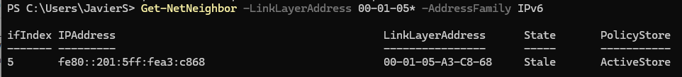

# Beckhoff RT-Linux – guía rápida comandos más habituales
Más información sobre comandos en [Beckhoff RT-Linux](https://infosys.beckhoff.com/content/1033/beckhoff_rt_linux/index.html?id=1171886970310160181) en Beckhoff Infosys

## Gestión de software de Beckhoff
  * Conectar remotamente desde otro pc con Windows desde consola PowerShell
    ```
    ssh Administrator@direccionIP
    ```
  * Buscar paquete de TwinCAT
    ```
    apt search nombre_del_paquete
    ```
> [!IMPORTANT] 
> Antes es necesario añadir el usuario de la web myBeckhoff al repositorio de Beckhoff, se explica más adelante.

  *	Instalar/actualizar un paquete
    ```
    sudo apt install nombre_del_paquete
    ```
    Ej: **instalar runtime de TwinCAT 4026**
    ```
    sudo apt install tc31-xar-um
    ```
    Algunos paquetes requieren configurar un servicio para que arranque automáticamente con el plc. P.ej: tf2000 hmi, tf6250 modbus, etc
  * Borrar paquete instalado. Con _purge_ se elimina además la configuración
    ```
    sudo apt remove nombre_del_paquete
    ```
    ```
    sudo apt purge nombre_del_paquete
    ```
  * Mostrar listado de paquetes instalados y sus versiones
    ```
    apt list -i
    ```
  * **Añadir credenciales de usuario de myBeckhoff (web) al repositorio de Beckhoff**
    1.	Editar el archivo de configuración:
        ```
        sudo nano /etc/apt/auth.conf.d/bhf.conf
        ```
    2.	Añadir email de usuario y contraseña:
        ```
        machine deb.beckhoff.com
        login example@mail.com
        password xyz123

        machine deb-mirror.beckhoff.com
        login example@mail.com
        password xyz123
        ```
  *	Instalación de una versión específica de un paquete
    1.	Creación de una carpeta de descargas
        ```
        mkdir /Downloads
        cd /Downloads
        ```
    2.	Descarga del paquete directamente de la web del [repositorio](https://deb.beckhoff.com/debian/pool/main/t/) Debian de Beckhoff.Ej:descarga del paquete TwinCAT TF2000 HMI v14.4.124:
        ```
        curl -sLo https://deb.beckhoff.com/debian/pool/main/t/tf2000-hmi-server-14.4.124.0_arm64.db
        ```
    3.	Instalación del paquete
        ```
        dpkg -i tf2000-hmi-server-14.4.124.0_arm64.db
        ```

## Comandos de RT-linux habituales
### Gestión de cpu
  *	Reiniciar
    ```
    sudo reboot
    ```
  *	Apagar
    ```
    sudo shutdown -h now
    ```
### Gestión de red
  *	Consultar dirección IP por adaptador de red. Mostrará el nombre del adaptador: 
    ```
    ip --brief a
    ```
  *	Descubrir dirección IP sin necesidad de conectar pantalla
    1.	Desde Windows ejecutar _ipconfig_. Localizar el identificador del adaptador
        ```
        Ethernet adapter Ethernet 5:
          Connection-specific DNS Suffix .. : example.com
          Link-local IPv6 Address . . . . . : fe80::5197:ef72:a352:b7f7%17 
        ```
    2.	Del adaptador de red encontrado antes en la configuración IPv6 (ej: 17), hacer ping por máscara de hardware ff02 usando ese identificador del adaptador: (nota: si no aparecen resultados puede estar bloqueado por firewall)
        ```
        ping ff02::1%17
        ```
    3.	Alternativa: mostrar listado por máscara de direcciónes MAC de Beckhoff (00:01:05)
        ```
        Get-NetNeighbor -LinkLayerAddress 00-01-05* -AddressFamily IPv6
        ```
        Resultado: muestra las direcciones IPv6 que coincidan con la direccion MAC de Beckhoff

        
        
        Luego para conectar por ssh desde la consola sería:
        ```
        ssh Administrator@fe80:201:5ff:xxx:xxx
        ```
  *	Asignar dirección IP
    1.	Crear un archivo de configuración según el nombre del adaptador (ej: _end0_)
        ```
        sudo nano /etc/systemd/network/10-end0-static.network
        ```
    2.	Asignar al adaptador de red una IP
        ```
        [Match]
        Name=end0

        [Network]
        Address=192.168.1.100/24
        ```
  *	Añadir excepción a puerto en el firewall. Por defecto el puerto ADS Secure (8016) ya está añadido en la configuración.
    1.	Crear o modificar un archivo de configuración. P.ej: (50-tcsystemservice.conf)
        ```
        sudo nano /etc/nftables.conf.d/50-tcsystemservice.conf
        ```
    2.	Añadir los puertos TCP o UDP. Por ejemplo, se añaden puertos ADS 48898 (conexion sin cifrado) y el puerto 2020 para el Hmi Server
        ```
        table inet filter {
          chain input {
            #accept ADS
            tcp dport 8016 accept
            tpc dport 48898 accept
            udp dport 48898 accept
        
            #TcHmi
            tcp dport 2020 accept
          }
        }
        ```
    3.	Recargar las listas del firewall
        ```
        sudo systemctl reload nftables
        ```
    4.	Visualizar qué puertos están abiertos
        ```
        sudo nft list ruleset
        ```
  * Listar sockets TCP/UDP abiertos o en escucha y qué IP está conectada
    ```
    sudo ss -tuln
    ```  

### Gestión de archivos
  *	Montar unidad usb
    1.	Buscar nombre de la unidad ejecutando:
        ```
        lsblk
        ```
    2.	Crear directorio donde se montará la unidad (p.ej: sdb1)
        ```
        sudo mkdir /media/usb1/
        ```
    3.	Montar la unidad:
        ```
        sudo mount /dev/sdb1 /media/usb1/
        ```
  *	Copiar archivos
      ```
      cp -r /rutaDirectorio1/ /rutaDirectorio2/
      ```
  *	Ir a un directorio
      ```
      cd /rutaAlDirectorio/
      ```
  *	Crear directorio
      ```
      mkdir nombreDirectorio
      ```
  *	Borrar directorio
      ```
      rm nombreDirectorio
      ```
